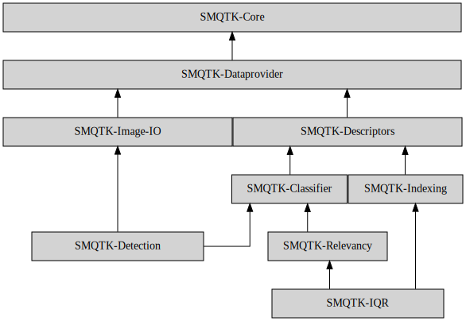

# SMQTK - Core

A light-weight, non-intrusive framework for developing interfaces that have
built-in implementation discovery and factory construction from a simple
configuration structure.

While anything may make use of this library, this was originally developed
as a foundation for a suite of packages that predominantly support **AI** and
**Machine Learning** use-cases:

* Scalable data structure interfaces and implementations, with a focus on those
  relevant for machine learning like descriptors, classifications, and object
  detections.

* Interfaces and implementations of machine learning algorithms with a focus on
  media-based functionality.
****
## Libraries
Some above-mentioned packages supporting AI/ML topics include the following:

* [SMQTK-Dataprovider] provides
  abstractions around data storage and retrieval.

* [SMQTK-Image-IO] provides
  interfaces and implementations around image reading and writing using
  abstractions defined in [SMQTK-Dataprovider].

* [SMQTK-Descriptors] provides
  algorithms and data structures around computing descriptor vectors from
  different kinds of input data.

* [SMQTK-Classifier] provides
  interfaces and implementations around black-box classification.

* [SMQTK-Detection] provides interfaces and support for black-box object
  detection.

* [SMQTK-Indexing] provides
  interfaces and implementations for efficient, large-scale indexing of
  descriptor vectors.
  The sources of such descriptor vectors may come from a multitude of sources,
  such as hours of video archives.
  Some provided implementation plugins include [Locality-sensitive Hashing
  (LSH)](https://en.wikipedia.org/wiki/Locality-sensitive_hashing) and FAIR's
  [FAISS] library.

* [SMQTK-Relevancy] provides
  interfaces and implementations for ranking datasets using human-in-the-loop
  feedback.
  This is a primary component for Interactive Query Refinement (IQR) systems
  that makes use of human feedback.

These packages are related as followed:


## This looks a lot like KWIVER! Why use this instead?
[KWIVER] is another open source package that similarly holds modularity,
plugins and configurability at its core.

The SMQTK-* suite of functionality exists separately from KWIVER for a few
reasons (for now):
* History
  * The origins of KWIVER and SMQTK were initiated at roughly the same
    time and were never resolved into the same thing because...
* Language
  * KWIVER has historically been predominantly C++ while SMQTK-* is (mostly)
    pure python. (see note below)
* Configuration UX
  * SMQTK takes an "add on" approach to configurability: concrete
    implementations have parameterized constructors and should be usable after
    construction like a "normal" object.
    Configuration semantics are derived from introspection of, and explicitly
    related to, the constructor.
    KWIVER takes an alternative approach where construction is generally empty
    and configuration setting is a required separate step via a custom object
    (`ConfigBlock`).
* Pythonic Plugin Support
  * Plugins are exposed via standard package entrypoints.

> If I'm using python, does that mean that SMQTK is __*always*__ the better
> choice?

At this point, not necessarily.
While this used to be true for a number of years due to SMQTK being the toolkit
with python support.
This is becoming more blurry KWIVER's continuously improving python binding
support.

## Building Documentation
Documentation is [hosted on ReadTheDocs.io here](
https://smqtk-core.readthedocs.io/en/stable/).

You can also build the sphinx documentation locally for the most up-to-date
reference:
```bash
# Install dependencies
poetry install
# Navigate to the documentation root.
cd docs
# Build the docs.
poetry run make html
# Open in your favorite browser!
firefox _build/html/index.html
```


[FAISS]: https://github.com/facebookresearch/faiss
[KWIVER]: https://github.com/kitware/kwiver
[SMQTK-Dataprovider]: https://github.com/Kitware/SMQTK-Dataprovider
[SMQTK-Image-IO]: https://github.com/Kitware/SMQTK-Image-IO
[SMQTK-Descriptors]: https://github.com/Kitware/SMQTK-Descriptors
[SMQTK-Classifier]: https://github.com/Kitware/SMQTK-Classifier
[SMQTK-Detection]: https://github.com/Kitware/SMQTK-Detection
[SMQTK-Indexing]: https://github.com/Kitware/SMQTK-Indexing
[SMQTK-Relevancy]: https://github.com/Kitware/SMQTK-Relevancy
